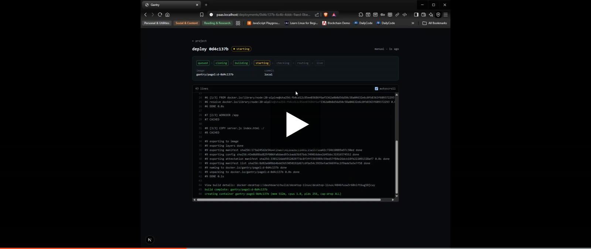
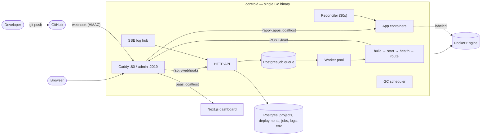

# Gantry

A single-node mini-PaaS push a repo, get a running app on its own subdomain, with live build logs, zero-downtime deploys, encrypted secrets, and a control plane that heals itself.

[](https://youtu.be/C4HnnOL1kvY)

▶ **[Watch the demo on YouTube](https://youtu.be/C4HnnOL1kvY)** (~40s)

---

## What it is

Point Gantry at a Git repo (or a local folder) that has a `Dockerfile`. It clones the source, builds a Docker image, runs it as a hardened container, health-checks it, and routes `‹app›.apps.localhost` to it through Caddy — blue/green, with zero dropped requests. A small dashboard gives you live build logs, an environment-variable editor, one-click rollback, and a disk view.

Under the hood it's a single Go control-plane binary (`controld`) that owns the HTTP API, a Postgres-backed job queue, the build/deploy pipeline, Caddy config management, a reconciliation loop, and a GC scheduler — plus a Next.js dashboard. Postgres and Caddy run in Docker; in dev, `controld` and the web app run as host processes.

## Highlights

- **Repo/folder → live URL in seconds.** Clone → build → health-check → route, driven by a Postgres job queue.
- **Live build logs** streamed over SSE, resumable across a refresh via `Last-Event-ID`.
- **Zero-downtime blue/green.** New container goes healthy before the route flips; the old one drains — **0 non-2xx across a deploy under 10 req/s of load.**
- **Self-healing.** `docker rm -f` a live container, or wipe Caddy's config, and the reconciler restores it in **under 30s**. Restarting `controld` re-renders all routes from the database.
- **Encrypted secrets.** Per-app env vars sealed with **AES-256-GCM** (random nonce per value), write-only in the UI, decrypted only at container-create time.
- **Rollback** to any previous build (skip-build, reuses the retained image) — same zero-downtime path.
- **Push-to-deploy.** GitHub `push` webhooks with HMAC verification, branch filtering, and delivery de-duplication.
- **Hardened job queue.** `FOR UPDATE SKIP LOCKED` claims, per-project advisory-lock serialization, supersession ("newest push wins"), heartbeats + a reaper that recovers jobs from a crashed worker.
- **Disk hygiene.** Image-retention GC (keep the last N deploys + live), dangling/build-cache prune, log purge, and a `docker system df` widget with a "Run GC now" button.

## Architecture



## Deploy pipeline

```
queued → cloning → building → starting → checking → routing → live
```

Failure paths (`build_failed`, `deploy_failed`, `superseded`, `canceled`) never take down the currently-live version. On success the previous deployment is drained and retired.

## Quickstart (dev)

Requirements: Docker Desktop, Go 1.23+, Node 22+, pnpm, GNU Make.

```bash
cp deploy/.env.example deploy/.env   # then edit the secrets (see below)
make dev                             # postgres + caddy + migrate + controld + web
```

Open http://paas.localhost and log in with `ADMIN_TOKEN`. Deployed apps are served at `http://‹slug›.apps.localhost`. (`.localhost` resolves to 127.0.0.1 automatically.)

Useful targets: `make up` / `make down` (infra only), `make migrate`, `make test` (unit), `make it` (integration — needs infra up), `make lint`, `make fmt`, `make nuke` (remove only gantry-labeled Docker resources).

## Deploying an app

Every project points at a **repo URL or a local path** and must contain a **`Dockerfile`** (Gantry is Dockerfile-based; there's no buildpack auto-detection). The container just needs to:

1. listen on the injected `$PORT` (Gantry assigns the host port and sets `PORT` in the env), and
2. return `2xx`/`3xx` at the configured health path (default `/`).

A minimal static-site example — a Vite build served on `$PORT`:

```dockerfile
FROM node:20-alpine AS build
WORKDIR /app
COPY package*.json ./
RUN npm ci
COPY . .
RUN npm run build

FROM node:20-alpine
WORKDIR /app
RUN npm install -g serve
COPY --from=build /app/dist ./dist
ENV PORT=3000
EXPOSE 3000
CMD ["sh", "-c", "serve -s dist -l ${PORT:-3000}"]
```

`examples/hello-node` is a zero-dependency Node app you can deploy immediately.

## Configuration

All configuration is environment variables, documented in `deploy/.env.example`. The security-relevant ones:

- `ADMIN_TOKEN` — dashboard/API bearer token.
- `GITHUB_WEBHOOK_SECRET` — HMAC secret for the GitHub webhook.
- `GANTRY_MASTER_KEY` — base64 32-byte key for env-var encryption.

Tunable cadences (defaults match the design; mostly for tests/demos): `GANTRY_WORKERS`, `GANTRY_REAPER_INTERVAL`, `GANTRY_JOB_STALE`, `GANTRY_HEARTBEAT`, `GANTRY_CANCEL_POLL`, `GANTRY_RECONCILE_INTERVAL`, `GANTRY_GC_INTERVAL`, `GANTRY_KEEP_IMAGES`, `GANTRY_BUILDER_KEEP_STORAGE`, `GANTRY_LOG_RETENTION`.

### Per-app environment variables

Set from the dashboard (or `PUT /api/projects/{id}/env`). Values are encrypted at rest with AES-256-GCM and are write-only in the UI — you can add/overwrite/delete keys and reveal a single value on demand (reveals are audit-logged), but the list view only shows key names. Saved vars are injected on the next deploy, or immediately via **Restart with new env**.

## GitHub webhooks

Gantry deploys automatically on push via `POST /webhooks/github` — no auth middleware; each request is authenticated by verifying the `X-Hub-Signature-256` HMAC against `GITHUB_WEBHOOK_SECRET`. Only `push` events are acted on, only for a project's configured branch; deliveries are de-duplicated by `X-GitHub-Delivery`; it responds `202` fast and does the work in the queue.

Configure the webhook under **Settings → Webhooks**: Payload URL = your public Gantry URL + `/webhooks/github`, content type `application/json`, secret = `GITHUB_WEBHOOK_SECRET`, event = just `push`.

**Forwarding to localhost in dev** (GitHub can't reach `paas.localhost`):

```bash
# smee.io — use the channel URL as the webhook Payload URL, then:
npx smee-client --url https://smee.io/<your-channel> --target http://paas.localhost/webhooks/github

# or cloudflared — set the printed URL + /webhooks/github as the Payload URL:
cloudflared tunnel --url http://paas.localhost
```

## Testing

```bash
make test    # Go unit tests (crypto, queue broker, SSE wire format, drift detection, byte parsing, …)
make it      # integration tests against Postgres (queue claim/supersede/reaper, env store, GC keep-set)
make lint    # go vet + web tsc --noEmit
```

## How it's built

`controld` is one Go binary with no package-level state — dependencies are injected. The web app is Next.js 15 (App Router, TypeScript, Tailwind, TanStack Query). It was built milestone by milestone, each with pasted done-criteria evidence:

- **M0** Skeleton — monorepo, compose, migrations, Caddy bootstrap, dashboard shell.
- **M1** Manual deploy end-to-end — project CRUD, the full clone→build→run→check→route pipeline, hardened containers.
- **M2** Live logs — SSE hub with backlog replay + `Last-Event-ID` resume, virtualized viewer.
- **M3** Queue hardening + webhooks — SKIP-LOCKED workers, advisory-lock serialization, supersession, cooperative cancel, reaper, GitHub webhooks.
- **M4** Zero-downtime + rollback + env — verified zero non-2xx under load, rollback, AES-256-GCM secrets.
- **M5** Reconciliation — self-heal missing containers, reap orphans, repair Caddy on drift.
- **M6** GC & disk — image retention, scheduled/on-demand GC, disk widget.

See `SPEC.md` for the full design and decision log, and `PROGRESS.md` for per-milestone evidence.
