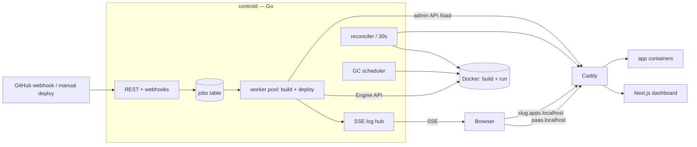

# SPEC.md — Gantry: a single-node Mini-PaaS (`git push` → live URL)

You are Claude Code, building this project from scratch in the current (empty) repo. This file is the authoritative spec. Save it as `SPEC.md` in the repo root and keep it updated per the operating instructions at the bottom.

"Gantry" is a working name (a gantry is the crane that moves shipping containers) — the human can rename it later; use it consistently for now in labels, prefixes, and env vars.

## 0. Mission

Build a self-hosted, single-node PaaS running on this machine:

1. The user registers a Git repo as a "project" with a subdomain.
2. A push to the repo (GitHub webhook) — or a manual "Deploy" click — triggers a pipeline: clone at that commit → build an OCI image with Docker/BuildKit → start a container with resource limits → health-check it → atomically switch the subdomain's route to the new container (zero downtime) → retire the old one.
3. Build and runtime logs stream live to a web dashboard.
4. A reconciliation loop heals drift (dead containers, lost proxy config), and a garbage-collection subsystem keeps disk usage flat (image retention, build-cache caps, log rotation).

This is a portfolio project. Correctness, observability, failure handling, and lifecycle management are first-class features — a reviewer should be able to kill things mid-flight and watch the system heal. Polish in those areas beats feature count.

## 1. Non-goals (v1)

- No Kubernetes, Swarm, or multi-node orchestration. (Design must not *preclude* a second node later — keep components decoupled — but do not build for it.)
- No user accounts, teams, or multi-tenancy. Single admin, token auth.
- No private-repo auth (public HTTPS clone or local-path clone only; deploy keys are future work).
- No autoscaling; exactly one container per project.
- No hard security guarantee against actively hostile repos. Apply real hardening (resource limits, cap-drop, network segmentation) but document the residual risk honestly (see Decisions appendix).

## 2. Architecture

Components:

1. **`controld`** — a single Go binary. Contains: REST API + GitHub webhook receiver, a Postgres-backed job queue with a worker pool, the build executor (Docker Engine API), the deploy orchestrator (blue/green), the Caddy config manager, the reconciliation loop, the GC scheduler, and an in-process SSE log hub.
2. **`web`** — Next.js dashboard (UI only; all state lives behind controld's API).
3. **Postgres 16** — source of truth: projects, deployments, env vars, the job queue, and persisted build logs.
4. **Caddy 2** (container) — reverse proxy for everything. controld rewrites its config at runtime via the admin API.
5. **Docker Engine** — builds images (BuildKit) and runs app containers.



Deploy request flow: webhook/manual → enqueue `build_deploy` job → worker claims it → shallow clone at SHA → build image → create container (env injected, limits applied) → health-check via published ephemeral port → render + `POST /load` new Caddy config pointing the subdomain at the new container → drain 10s → stop/remove old container → mark deployment `live`, previous → `retired`.

## 3. Fixed tech stack — do not relitigate; ask before adding any dependency

- **Go 1.22+**: `chi` (router), `pgx/v5`, `golang-migrate`, official Docker SDK (`github.com/docker/docker/client`), `log/slog`. `sqlc` optional if it helps.
- **Next.js 15** (App Router, TypeScript), Tailwind, shadcn/ui, TanStack Query, native `EventSource` for SSE. Log view: simple auto-scrolling virtualized list (no xterm.js unless trivial).
- **Postgres 16**, **Caddy 2.8+**, **Docker Engine 24+** with BuildKit.
- Explicitly NOT: Redis, any ORM, Kubernetes, message brokers. Postgres is the queue (see Decisions D1).

## 4. Repo layout

```
gantry/
  apps/web/                   # Next.js dashboard
  services/controld/
    cmd/controld/main.go
    internal/api/             # handlers, middleware, SSE endpoints
    internal/queue/           # jobs table client, worker pool, reaper
    internal/build/           # clone + image build
    internal/deploy/          # blue/green orchestration, health checks
    internal/proxy/           # Caddy config render + admin client
    internal/reconcile/
    internal/gc/
    internal/logs/            # log hub: batch writer + pub/sub + SSE fanout
    internal/store/           # pgx queries, migrations runner
    internal/crypto/          # AES-GCM env-var encryption
  deploy/
    docker-compose.yml        # postgres + caddy
    caddy-bootstrap.json      # minimal config: admin API enabled, nothing else
    .env.example
  examples/hello-node/        # Express app: /healthz, prints env, Dockerfile
  examples/hello-static/      # static site + Dockerfile (nginx or caddy file-server)
  migrations/
  Makefile                    # dev, migrate, test, it, lint, nuke
  SPEC.md                     # this file
  PROGRESS.md                 # you maintain: per-milestone checklists + DoD evidence
```

## 5. Runtime topology & networking

- Docker networks: `gantry-core` (caddy, postgres) and `gantry-apps` (caddy + every deployed app container). App containers must never join `gantry-core`.
- In dev, `controld` and `web` run as host processes (`go run`, `pnpm dev`). Compose runs only postgres (publish `127.0.0.1:5432`) and Caddy (publish `80:80`, admin `127.0.0.1:2019:2019`).
- Caddy proxies to host processes via `host.docker.internal` — on Linux this requires `extra_hosts: ["host.docker.internal:host-gateway"]` in compose. Include it.
- Routing (all rendered by controld):
  - `paas.localhost` → path `/api/*` and `/webhooks/*` → `host.docker.internal:8080` (controld); everything else → `host.docker.internal:3000` (web).
  - `<subdomain>.apps.localhost` → `<container-name>:<project.port>` via Docker DNS on `gantry-apps`.
- Plain HTTP locally. `*.localhost` resolves to 127.0.0.1 in modern browsers and in systemd-resolved; for curl use `curl -H "Host: hello.apps.localhost" http://127.0.0.1/`. If port 80 is taken, honor `GANTRY_HTTP_PORT`.
- Windows host: everything (Docker, Go, Node, this repo) lives inside WSL2 Ubuntu. Do not split across the Windows/WSL boundary.
- All Docker resources you create (images, containers, networks, volumes) MUST carry label `dev.gantry.managed=true` plus `dev.gantry.project=<slug>` / `dev.gantry.deployment=<id>` where applicable. Every listing/pruning operation MUST filter by this label. Never touch unlabeled resources on this machine.

## 6. Data model (migrations from M0)

```sql
projects(
  id uuid pk, name text, slug text unique,           -- slug = subdomain
  repo_url text,                                     -- https URL or absolute local path (dev)
  branch text default 'main',
  dockerfile_path text default 'Dockerfile',
  port int not null,                                 -- port the app listens on
  health_path text default '/',
  created_at timestamptz default now()
)

deployments(
  id uuid pk, project_id uuid fk, commit_sha text, commit_message text,
  trigger text,                                      -- webhook | manual | rollback | env_restart
  status text,                                       -- see state machine
  image_tag text, container_name text, host_port int,-- ephemeral 127.0.0.1 port for health checks
  error text, created_at, started_at, finished_at timestamptz
)

jobs(
  id bigserial pk, kind text, payload jsonb,
  status text,                                       -- queued|running|done|failed|canceled|superseded
  priority int default 0, attempts int default 0, max_attempts int default 2,
  run_after timestamptz default now(),
  dedupe_key text unique,                            -- e.g. github delivery id
  cancel_requested bool default false,
  locked_by text, locked_at timestamptz, created_at timestamptz default now()
)

log_lines(deployment_id uuid, seq bigint, stream text, line text, ts timestamptz,
          primary key(deployment_id, seq))

env_vars(project_id uuid, key text, value_enc bytea, nonce bytea,
         updated_at timestamptz, primary key(project_id, key))

webhook_deliveries(delivery_id text pk, received_at timestamptz)
```

## 7. Job queue semantics (Postgres, hand-rolled — this is a showcase piece)

- Claim query (workers poll every 500ms with jitter):

```sql
UPDATE jobs SET status='running', locked_by=$1, locked_at=now(), attempts=attempts+1
WHERE id = (
  SELECT id FROM jobs
  WHERE status='queued' AND run_after <= now()
  ORDER BY priority DESC, id
  FOR UPDATE SKIP LOCKED
  LIMIT 1
) RETURNING *;
```

- **Per-project serialization**: after claiming a `build_deploy` job, acquire `pg_try_advisory_lock(hashtext('gantry:project:' || project_id))` on a dedicated connection held for the job's duration. On failure, requeue with `run_after = now() + 10s`.
- **Supersession**: when enqueueing a build for project P: mark any *queued* `build_deploy` jobs for P as `superseded`; if one is *running*, set `cancel_requested=true`. Workers poll that flag (2s) and their job context is canceled → build stream/subprocess killed, temp dir cleaned, deployment status `superseded`. Newest push always wins.
- **Reaper** (every 30s): jobs `running` with `locked_at` older than 60s (heartbeat: workers refresh `locked_at` every 15s) → back to `queued` if attempts < max, else `failed`.
- **Retries**: exponential backoff via `run_after`; never retry `canceled`/`superseded`.
- Global worker concurrency: `GANTRY_WORKERS` (default 2).

## 8. Deploy pipeline state machine

`queued → cloning → building → starting → checking → routing → live`
Failure paths: `build_failed`, `deploy_failed`, `superseded`, `canceled`. On success, the previously-live deployment → `retired`.

Details:
- **Clone**: shallow (`--depth 1`) at the SHA into a per-job temp dir; always cleaned in a defer. Accept absolute local paths as `repo_url` for development.
- **Build**: Docker Engine API `ImageBuild` with BuildKit; tag `gantry/<slug>:d-<deploy8>`, labels per §5. Stream every output line into the log pipeline. Timeout `GANTRY_BUILD_TIMEOUT` (default 15m).
- **Start**: create container `gantry-<slug>-<deploy8>` on `gantry-apps`, env vars decrypted and injected, limits per §12, and publish the app port to an ephemeral host port bound to 127.0.0.1 (`HostIP: "127.0.0.1", HostPort: ""`). Record the assigned `host_port`.
- **Check**: `GET http://127.0.0.1:<host_port><health_path>` every 2s, up to 60s; healthy = any 200–399. (Why the published port: see Decisions D2.)
- **Route**: render full Caddy config from DB (with the new upstream) and `POST /load`. Atomic (see D3).
- **Retire**: wait 10s drain → `docker stop` (10s timeout) → `docker rm` old container. Image stays (retention handles it).
- **Failure**: health check never green → remove the new container, mark `deploy_failed` with the reason; the old deployment keeps serving untouched.
- **Rollback**: `POST /api/projects/{id}/rollback {deployment_id}` → enqueue a deploy job with `skip_build=true` reusing that deployment's retained image; identical blue/green path; trigger=`rollback`.
- **Env restart**: env-var changes require a redeploy; "Restart with new env" enqueues skip-build deploy from the current image (trigger=`env_restart`).

## 9. Caddy management

- Caddy boots from `caddy-bootstrap.json` (admin listener only). controld owns the rest.
- controld renders the **entire desired config** (dashboard routes + one route per live app) from the DB and `POST http://127.0.0.1:2019/load` — on boot, on every route change, and whenever the reconciler detects drift. Idempotent by construction; no surgical PATCHes (D3).
- Config renderer is a pure function `[]Project+[]LiveDeployment → caddy JSON` with golden-file tests.

## 10. Log pipeline

- **Build logs**: producer → hub → (a) batch writer to `log_lines` (flush at 100 lines or 200ms) and (b) per-deployment in-process pub/sub for live subscribers.
- **SSE contract** (`GET /api/deployments/{id}/logs`): on connect, replay backlog from `seq > Last-Event-ID` (default 0), then stream live; SSE event `id` = seq, so browser auto-reconnect resumes seamlessly. Heartbeat comment every 15s. Slow client: buffered channel of 1000; on overflow, send a `gap` event and drop the client.
- Status changes also stream (`GET /api/deployments/{id}/events`) so the pipeline UI updates live; polling fallback acceptable at M1 only.
- **Runtime logs** (`GET /api/projects/{id}/runtime-logs`): attach `docker logs --follow --tail 500` to the live container and fan out the same way. Not persisted by us — containers are created with log opts `max-size=10m, max-file=3`.
- Never log decrypted env values anywhere; redact by key on sight.

## 11. Env vars & secrets

AES-256-GCM with a random nonce per value; key from `GANTRY_MASTER_KEY` (32 bytes, base64). Values write-only in the UI (set/overwrite/delete; reveal requires an explicit "reveal" call, audit-logged via slog). Decrypt only at container-create time. Crypto round-trip unit tests required.

## 12. App container security & resource defaults

`--memory 512m --cpus 1.0 --pids-limit 256`, `CapDrop: ALL`, `no-new-privileges`, restart policy `on-failure:3` (reconciler handles the rest), never mount the Docker socket or host paths into apps, apps only on `gantry-apps`. Defaults overridable per project later; hardcode for v1. Build-time network is NOT sandboxed in v1 (D4).

## 13. Reconciliation loop (every 30s)

Desired state = DB (each project's `live` deployment). Actual = `docker ps -a` filtered by the gantry label.
- Live deployment's container missing/dead → recreate from its image, health-check, re-render Caddy. Log the healing action.
- Gantry-labeled container with no matching live deployment → stop/remove.
- Rendered Caddy config ≠ current (`GET /config/`) → `POST /load`.
Every action logged at `warn` with a `reconciler=true` attribute — these logs are demo material.

## 14. GC & disk lifecycle (first-class feature)

- **Image retention**: keep images for the last `GANTRY_KEEP_IMAGES` (default 3) deployments per project + whatever is live; delete older (label-filtered).
- **Scheduled GC job** (nightly + on-demand `POST /api/system/gc`): retention pass, dangling-image prune, BuildKit cache prune with `keep-storage = GANTRY_BUILDER_KEEP_STORAGE` (default 20GB), purge `log_lines` older than 14 days, remove exited gantry containers from failed deploys.
- **Dashboard disk widget**: surface `docker system df` (images/containers/build-cache, reclaimable) + "Run GC now" button.

## 15. API surface (controld, `/api` prefix; Bearer `ADMIN_TOKEN` or session cookie)

```
POST   /api/login                       {token} → httpOnly cookie
GET    /api/projects                    list w/ live status
POST   /api/projects                    create
GET    /api/projects/{id}               detail + deployments
POST   /api/projects/{id}/deploy        manual deploy (optional {sha})
POST   /api/projects/{id}/rollback      {deployment_id}
PUT    /api/projects/{id}/env           upsert/delete keys; triggers nothing by itself
POST   /api/projects/{id}/env/restart   skip-build redeploy with new env
GET    /api/projects/{id}/runtime-logs  SSE
GET    /api/deployments/{id}            detail
GET    /api/deployments/{id}/logs       SSE, Last-Event-ID resume
GET    /api/deployments/{id}/events     SSE status stream
POST   /api/deployments/{id}/cancel
GET    /api/system/disk                 docker system df summary
POST   /api/system/gc
POST   /webhooks/github                 HMAC-verified (GITHUB_WEBHOOK_SECRET), no auth middleware
GET    /api/healthz
```

Webhook rules: verify `X-Hub-Signature-256`; only `push` events on the project's configured branch; dedupe on `X-GitHub-Delivery` via `webhook_deliveries` + jobs `dedupe_key`; respond 202 fast, work happens in the queue.

## 16. Dashboard pages

`/login` · `/` (project cards: status, subdomain link, last deploy; disk widget) · `/projects/new` · `/projects/[id]` (deployment timeline w/ per-row Rollback, env editor, runtime logs tab, settings, Deploy Now) · `/deployments/[id]` (state-machine progress header + live log viewer w/ autoscroll toggle). Dark, terminal-ish aesthetic; function over flash.

## 17. Milestones — strictly in order; each ends with you RUNNING the DoD and pasting evidence into PROGRESS.md

**M0 — Skeleton.** Monorepo, compose (postgres+caddy w/ bootstrap config + host-gateway), migrations, `controld` with `/api/healthz`, Next.js shell, Makefile, `.env.example`, initial Caddy render/load on controld boot.
*DoD*: `make dev` brings everything up; `http://paas.localhost` serves the dashboard shell; `curl http://paas.localhost/api/healthz` → `{"ok":true}`; `curl -s 127.0.0.1:2019/config/ | jq '.apps.http'` shows controld-rendered routes; `make migrate` idempotent.

**M1 — Manual deploy, end to end.** Project CRUD, the full pipeline (§8) for a repo with a Dockerfile, logs persisted (polling fetch OK), Caddy route live. Support local-path `repo_url` so `examples/hello-node` deploys without GitHub.
*DoD*: create project for `examples/hello-node` → Deploy → status reaches `live`; `curl -H "Host: hello.apps.localhost" http://127.0.0.1/` returns the app; build log visible in UI; `docker ps` shows labeled container with limits (`docker inspect` proves CapDrop/memory/log-opts).

**M2 — Live logs.** SSE hub, backlog + resume, live status stream, log viewer UI.
*DoD*: open deployment page mid-build → lines stream live; hard-refresh mid-build → full backlog then continues (Last-Event-ID works); two tabs stream concurrently.

**M3 — Queue hardening + webhooks.** SKIP LOCKED worker pool, advisory-lock serialization, supersession + cancel, heartbeats + reaper, backoff, webhook endpoint + HMAC + dedupe. Document `smee.io`/`cloudflared` webhook forwarding in the README.
*DoD*: trigger two deploys back-to-back → first becomes `superseded` and its build actually stops; `kill -9` controld mid-build → restart → reaper requeues and the deploy completes; webhook with bad signature → 401, valid replayed delivery → deduped; queue unit tests pass (concurrent-claim, supersession, reaper).

**M4 — Zero-downtime + rollback + env.** Blue/green with health gating, drain, failure keeps old live; rollback; encrypted env vars + skip-build restart.
*DoD*: script a curl loop (10 req/s) against the app during a deploy → zero non-2xx; deploy a broken build (health 500) → `deploy_failed`, old version still serving; Rollback → previous version live again; env var set + restart visibly changes app output; DB dump shows only ciphertext.

**M5 — Reconciliation.** The 30s loop per §13; Caddy re-render on drift; controld restart fully re-renders from DB.
*DoD*: `docker rm -f` the live container → recreated and serving within 30s; wipe Caddy config via admin API → restored within 30s; restart controld → routes intact.

**M6 — GC & disk.** Retention, prunes, log purge, disk widget + GC button.
*DoD*: deploy 5 times → `docker images` (label-filtered) shows only last 3 + live; builder cache shrinks under the cap after GC; widget numbers match `docker system df`.

**M7 — Stretch (ask which the human wants).** (a) Nixpacks fallback for Dockerfile-less repos; (b) public mode: real wildcard domain + cloudflared/port-forward + Caddy `on_demand_tls` with an `/internal/caddy/ask` allowlist endpoint; (c) containerize controld (`make up` prod-ish mode); (d) README polish: architecture diagram, demo GIF of push→live, "chaos demo" section.

## 18. Engineering standards

- `slog` structured logging everywhere (request IDs, job IDs); errors wrapped with `%w`; no panics in request/worker paths; graceful shutdown on SIGINT (stop claiming, cancel builds cleanly, flush log batches, drain SSE).
- `context.Context` through every blocking operation. No package-level mutable state; dependencies injected.
- Tests: table-driven for queue semantics (hammer claim with 10 goroutines), crypto round-trip, Caddy render golden files. Docker-touching integration tests behind `-tags=integration` (`make it`).
- `go vet` + `golangci-lint` + `pnpm typecheck` clean before any milestone is "done".
- Conventional commits, one logical change per commit, commit at least once per milestone task.

## 19. Operating instructions for you, Claude Code

1. Read this entire spec before writing anything. Then create `PROGRESS.md` with all milestones as checklists.
2. Work ONE milestone at a time. A milestone is done only after you run its DoD commands yourself and record the evidence in `PROGRESS.md`.
3. Every Docker operation you perform is label-scoped (§5). Never run global prunes or touch unlabeled resources. `make nuke` = remove all gantry-labeled resources only.
4. Ask before: adding dependencies, deviating from this spec, or anything needing sudo. For small ambiguities, decide, proceed, and record it in the Decisions appendix below.
5. Prefer real integrations over mocks; the health of this project is proven by the DoD chaos drills, not by mock coverage.

## 20. Decisions appendix (pre-seeded; append yours)

- **D1 — Postgres as the queue, no Redis**: one fewer moving part; enqueueing is transactional with state changes; `FOR UPDATE SKIP LOCKED` is plenty at this scale.
- **D2 — Health checks via 127.0.0.1 ephemeral published port**: host→container-bridge-IP is unreliable on Docker Desktop/WSL2; traffic still routes Caddy→container via Docker DNS, so the published port is used for health only.
- **D3 — Full Caddy config render + `POST /load`** instead of surgical patches: atomic, idempotent, trivially self-healing; a diff-based patch is a later optimization at most.
- **D4 — Build network not isolated in v1**: package installs need egress; documented risk. Future: egress allowlist proxy or gVisor/rootless BuildKit.
- **D5 — Single `controld` binary**: simplest ops; internal packages have clean interfaces so a future builder-node split stays possible.

### Decisions added during build (Claude Code)

- **D6 — Execution environment is native Windows + Docker Desktop, NOT WSL2** (deviates from §5 "everything inside WSL2 Ubuntu"). Rationale: in this machine's session, WSL2 Ubuntu shell-exec times out (`HCS_E_CONNECTION_TIMEOUT`) and cannot be driven reliably, while native Windows Go 1.23.3 / Node 22 / pnpm 11 / Docker Desktop 27.4 all work. Docker Desktop still runs *Linux* containers (Postgres, Caddy, apps) in its own WSL2 VM, and bridges `host.docker.internal` + published ports to the Windows host, so the spec's Linux-container semantics are preserved. `controld` and `web` run as native Windows host processes. Chosen by the human when presented the tradeoff. Consequence: paths, line endings (`.gitattributes` forces LF), and the Docker endpoint are handled Windows-side.
- **D7 — Docker endpoint = default named pipe `npipe:////./pipe/docker_engine`** (verified serving 27.4.0). The Go SDK uses `client.FromEnv` + API-version negotiation; overridable via `DOCKER_HOST`. Note Docker Desktop's current CLI context is `desktop-linux` (`dockerDesktopLinuxEngine` pipe), but the classic `docker_engine` pipe is also served and is what the SDK defaults to on Windows.
- **D8 — Migrations run via the embedded `golang-migrate` library** (`iofs` source over `//go:embed migrations`), not the `migrate` CLI (not installed). `make migrate` invokes `controld migrate`. Idempotent by golang-migrate's version table.
- **D9 — `host.docker.internal:host-gateway`** is still declared in compose `extra_hosts` for parity with the spec; on Docker Desktop the name resolves automatically, so this is a harmless no-op that keeps the compose file portable to a future real-Linux/WSL host.
- **D10 — `jq` is not installed on the host**; DoD JSON assertions are evidenced with `node -e` one-liners instead. The literal `jq` command from the spec DoD still works for a reviewer who has jq installed.
- **D16 — M1 dashboard uses plain Tailwind components; logs are polled, not streamed.** The spec lists shadcn/ui and SSE, but for M1 the UI is built with hand-rolled Tailwind components (no shadcn setup yet) and the log viewer polls `GET /deployments/{id}/logs?after=<seq>` on a 1s interval. M2 introduces the SSE hub (backlog replay + Last-Event-ID) and the viewer switches to `EventSource`; shadcn can be layered in later. TanStack Query is used per spec.
- **D14 — Image builds shell out to `docker build` (BuildKit); everything else uses the Docker SDK.** The spec (§8) says "Engine API `ImageBuild` with BuildKit," but BuildKit over the SDK's `/build` endpoint requires a live buildkit **session** (filesync/auth providers) — significant, fragile machinery. Shelling out to `docker build` gives genuine BuildKit (so M6's build-cache prune is meaningful), line-by-line log streaming, and clean cancellation for M3 supersession (kill the subprocess). All container/image/network/system operations still go through `github.com/docker/docker/client` per §3. The builder is behind a `build.Builder` interface, so swapping to an SDK-session implementation later is localized.
- **D15 — `examples/hello-node` uses Node's core `http` module, no npm dependencies.** The spec calls it an "Express app," but a zero-dependency app means the Docker image builds without any `npm install` network step — faster and more reliable for the DoD/chaos drills — while still serving `/healthz` and printing env. (Base images like `node:20-alpine` still pull via Docker Desktop's own network, which is unrestricted.)
- **D12 — Makefile recipes dispatch through `bash`.** The host's `make` (`/d/bin/make`, GNU Make 4.4) is a Cygwin-flavored build whose default shell resolves Windows executables via `/cygdrive/...` paths and fails to exec `docker`/`go`/`node` (spaces in path + `.exe`). Every tool-invoking recipe therefore runs via `bash -c '…'` or `bash scripts/*.sh`, which resolves to Git Bash (MSYS) where those binaries work. This also keeps the multi-step targets (`dev`, `migrate`, `nuke`) readable as real shell scripts under `scripts/`.
- **D13 — Web dev server is launched via `node node_modules/next/dist/bin/next dev`, not `pnpm dev`.** pnpm 11 runs an implicit "verify-deps-before-run" install before any `pnpm <script>`, which exits non-zero here over sharp's un-approved native build script. Invoking Next (and `tsc`) directly through node bypasses pnpm's script runner entirely. `pnpm install` itself is unaffected and still used for dependency installation.
- **D11 — Single Go module rooted at the repo root** (`github.com/avishuklacode/gantry`, `go.mod` at `D:\paas`). Rationale: `//go:embed` cannot reference paths outside its own module/dir tree, and the spec keeps `migrations/` at the repo root; rooting the module there lets `migrations/embed.go` embed the SQL and lets `controld` import it. controld code stays physically under `services/controld/...` (import path `.../services/controld/internal/...`). `go build ./...` compiles the whole tree; the Node app under `apps/web` is ignored by Go.
- **D21 — M6 GC & disk specifics.** (a) GC runs synchronously inside the `POST /api/system/gc` request (the passes are fast prune/DB ops) and on a `GANTRY_GC_INTERVAL` ticker, rather than through the job queue; a mutex makes it single-flight (concurrent requests get `409`). This keeps the dashboard button responsive without adding a queue job kind. (b) Pass order is deliberate: exited gantry app-containers are removed first so their images become deletable, then image retention, dangling prune, BuildKit cache prune, and log purge. (c) Retention keeps, per project, the images of the `GANTRY_KEEP_IMAGES` most recent deployments plus any live deployment's image (a rollback can make an old image live again, so "live" is checked explicitly, not just recency). (d) Container cleanup and dangling prune are label-scoped and, like the reconciler, only touch containers carrying a `dev.gantry.deployment` label — infra is untouchable. (e) BuildKit cache prune uses `CachePruneOptions.ReservedSpace` (the current field; the deprecated `KeepStorage` is also set for older daemons) parsed from `GANTRY_BUILDER_KEEP_STORAGE`. (f) The disk widget mirrors `docker system df` from the Engine `DiskUsage` API; counts and sizes match the CLI exactly, while *reclaimable* is a deliberate approximation that clamps the negative image-reclaimable value the CLI sometimes prints (a shared-layer accounting artifact).
- **D20 — M5 reconciliation specifics.** (a) Infra safety is structural: `gantry-postgres`/`gantry-caddy` carry `dev.gantry.managed=true` (so compose can label its resources) but have no `dev.gantry.deployment` label; the reconciler only ever considers containers with a non-empty deployment label, so infra is categorically ineligible for reaping. (b) Orphan reaping protects any deployment that isn't terminal (live + in-flight `queued/cloning/building/starting/checking/routing`), so a container a running deploy is mid-way through creating is never removed. (c) Container recreation reuses the deploy pipeline pieces (decrypt env → `CreateAndStart` → `HealthCheck` → record `host_port`) under the project advisory lock, so healing never races a concurrent deploy; a recreated container that fails its health gate is removed and retried next sweep rather than flipping the deployment's status. (d) Caddy drift is detected by checking that every expected host and dial (`paas.localhost`, each `<slug>.apps.localhost` and its `<container>:<port>` dial) appears in Caddy's live `/config/` — a cheap substring check that a wiped or partial config fails, avoiding brittle full-JSON comparison against Caddy's normalized output. (e) Because Caddy dials apps by container name over `gantry-apps`, a same-name recreate is immediately reachable via Docker DNS; controld's boot `RenderAndLoad` plus the drift pass mean routes survive both a controld restart and an external Caddy wipe.
- **D19 — M4 env + rollback specifics.** (a) Env values are AES-256-GCM sealed with a fresh 12-byte nonce per value (`internal/secret`); ciphertext and nonce live in separate `env_vars` columns and are only ever opened at container-create time — never logged (on decrypt failure only the key is named). (b) The env UI is write-only: list returns keys + `updated_at`, mutations go through `PUT .../env` (`{set,delete}`) which changes nothing about running containers by itself, and a single value is exposed only via an explicit, `warn`-audited `POST .../env/reveal`. (c) A missing/invalid `GANTRY_MASTER_KEY` disables env features (`secret.New` fails → `Server.Secrets` nil → 503) rather than storing plaintext. (d) Rollback and env-restart share one path: create a deployment that reuses a retained `image_tag` (rollback → a chosen deployment's; env-restart → the current live's) and enqueue a `skip_build` deploy through the same supersession-aware `EnqueueDeploy`, so they run the identical zero-downtime blue/green pipeline. Because env is injected at create time (not baked into the image), rollback restores code while env stays current. (e) Zero-downtime falls out of the existing order — new container healthy → promote in DB → atomic Caddy `/load` → *then* 10s drain + stop old — so a failed health gate simply never promotes and the old container keeps serving. The `hello-node` example gained a `FAIL_HEALTH` env toggle to exercise that path on demand.
- **D18 — M3 queue-hardening specifics.** (a) Cooperative cancel rides `context.WithCancelCause`: the worker's cancel poller cancels the job context with `ErrSuperseded`/`ErrCanceled`, and the orchestrator's failure handler reads `context.Cause` to pick the terminal deployment status — so the same mechanism that kills the `docker build`/`git` subprocess (they run under `exec.CommandContext`) also records *why*. (b) The **pool** owns the job's terminal status: after the handler returns it sets done/failed/canceled/superseded from the cause. Because a `build_deploy` handler records the deployment's own outcome and returns nil, deploy-level failures are terminal (not retried); the retry surfaces are worker death (reaper requeues stale `running` jobs by `locked_at`) and project-lock contention (requeue after a delay, attempt not counted). (c) Per-project serialization is a session-scoped `pg_try_advisory_lock(hashtext('gantry:project:'||id))` held on a dedicated pooled connection for the job's duration; a `kill -9` drops the connection and Postgres releases the lock, so the reaped job can re-acquire it. (d) `project_id` is carried in the job payload so supersession/serialization never have to load the deployment. (e) The cadences (reaper 30s, stale 60s, heartbeat 15s, lock-retry 10s, cancel-poll 2s) are env-overridable — spec defaults in prod, small values in tests/demos. (f) Webhook project matching normalizes git URLs (https/ssh/scp/`.git`/`user@`) to `host/owner/repo` and compares against the push's clone/html/ssh/full_name forms; delivery dedupe is primary via `webhook_deliveries`, with a per-`(delivery,project)` job `dedupe_key` as a backstop.
- **D17 — M2 SSE + log-viewer specifics.** (a) The log fan-out is an in-process generic `broker[T]`; `Writer.Line` publishes each line to subscribers under the same lock that assigns its seq, so subscribers observe strict seq order without a separate sort. (b) The `/logs` handler subscribes *before* reading the DB backlog and dedupes replayed lines by `seq <= maxSent`, closing the produce→replay gap without double-sending. (c) Overflow follows §10 literally — a subscriber that fills its 1000-deep buffer is dropped and sent an `event: gap`; the browser can hard-refresh to replay from the DB. (d) `/events` publishes the **full deployment row** on connect and on each transition (not just the status string), so the UI updates image/container/port/error live and a reconnect always re-syncs; no Last-Event-ID is needed for status. (e) The viewer is virtualized as a windowed fixed-row-height list (18px rows, single-line `white-space: pre` with horizontal scroll) over a bounded 5000-line tail — true windowing without the fragile variable-height measurement that wrapping would require, matching the spec's "simple … virtualized list (no xterm.js)."
```

Operating note: this file is authoritative and kept updated as the build proceeds; new build-time decisions are appended to §20.
